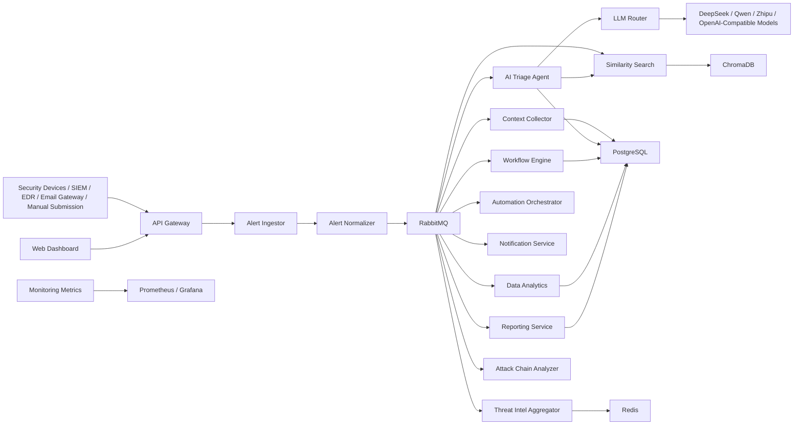
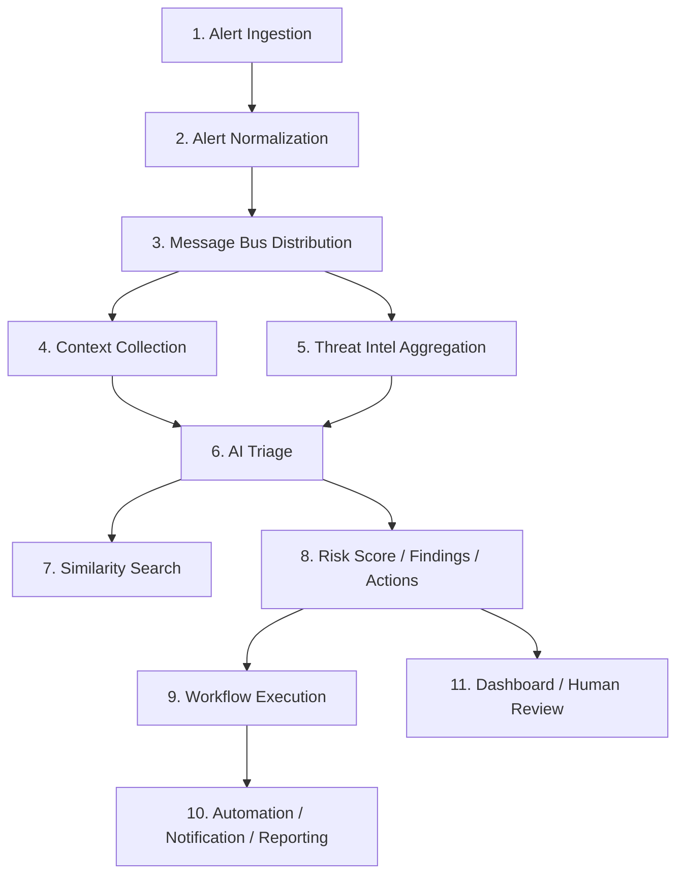
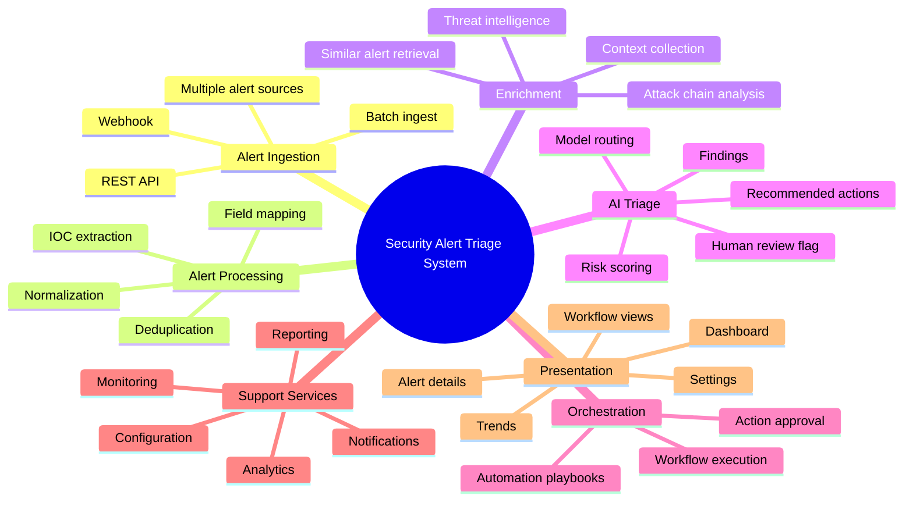

# Security Alert Triage System - Complete Architecture Diagram

## Current Repository Architecture (2026-03-08)

This section reflects the actual service layout and message flow implemented in the
current repository. The historical diagrams below remain useful as design intent,
but they are no longer the sole source of truth.

### Current End-to-End Architecture



### Current Functional Flow



### Current Capability Map



## Architecture Fit Assessment (2026-03-08)

### Summary

| Area | Status | Assessment |
|------|--------|------------|
| Core ingestion pipeline | Implemented | Ingestor, normalizer, enrichment, triage, and queue flow exist and are tested |
| Message-driven architecture | Implemented | RabbitMQ publisher/consumer paths are present and integration-tested |
| Vector similarity search | Implemented | ChromaDB-backed similarity service exists with indexing and query APIs |
| Multi-provider LLM routing | Implemented | Router supports DeepSeek, Qwen, Zhipu, and model capability-based routing |
| Workflow and automation | Partially implemented | Workflow engine and automation orchestrator exist, and the workflow service now includes a Temporal-backed execution path with local fallback |
| Notifications | Partially implemented | Service and channels exist, but some channels remain mock/TODO |
| Configuration management | Partially implemented | Configuration state is now persisted in the database, but cross-service config propagation is still incomplete |
| Analytics and reporting | Partially implemented | Main metrics and report metadata are now persisted or derived from the database, but the full analytics platform is still below the original production design |
| Security and auth | Partially implemented | API gateway now has database-backed JWT auth, role-derived permissions, and enforced protection on core alert/analytics routes, but full RBAC coverage is still incomplete across all route groups |
| Observability | Partially implemented | Health/metrics endpoints exist, but full tracing/logging platform is not wired end-to-end |

### What Clearly Matches The Architecture

- The repository does implement the intended microservice split across ingestion, enrichment,
  AI analysis, workflow, support, and presentation layers.
- The main asynchronous alert pipeline is real rather than only documented:
  `alert.raw -> alert.normalized -> alert.enriched -> alert.result`.
- Shared models, messaging, and database layers are used consistently across services.
- Similarity search, threat intelligence aggregation, and AI triage are not placeholders;
  they have working code paths and passing tests.

### What Is Only Partially Aligned

- The workflow layer now has a Temporal integration path, but the service still keeps
  a local execution fallback and has not fully migrated all orchestration semantics to Temporal.
- Notification, reporting, analytics, and configuration services are present, but some
  surrounding production behaviors such as event propagation, scheduling, and channel completeness are still unfinished.
- Monitoring exists as a service-level implementation, but the broader observability stack
  described in the historical design is not fully realized in code.

### Main Gaps Against The Original Architecture Design

1. JWT auth and permission derivation exist, and core alert/analytics routes are now enforced, but route-wide coverage and richer RBAC policy granularity are still incomplete.
2. Centralized configuration is now persisted, but not yet fully event-driven across services.
3. Workflow orchestration has a Temporal-backed path, but not all executions and activities are migrated to it yet.
4. Observability is serviceable for development, but below the original production design target.
5. Some support-channel integrations remain mocked rather than fully operational.

### Evidence Pointers

- Core ingestion and queue flow:
  - `services/alert_ingestor/main.py`
  - `services/alert_normalizer/main.py`
  - `services/context_collector/main.py`
  - `services/ai_triage_agent/main.py`
- Routing and similarity:
  - `services/llm_router/main.py`
  - `services/similarity_search/main.py`
- Workflow and automation:
  - `services/workflow_engine/main.py`
  - `services/automation_orchestrator/main.py`
- Support services:
  - `services/notification_service/main.py`
  - `services/reporting_service/main.py`
  - `services/data_analytics/main.py`
  - `services/configuration_service/main.py`
  - `services/monitoring_metrics/main.py`
- Security/auth:
  - `services/api_gateway/routes/auth.py`

## System Overview

```
┌─────────────────────────────────────────────────────────────────────────────────────┐
│                        SECURITY ALERT TRIAGE SYSTEM                                │
│                         (AI-Powered SOC Automation Platform)                        │
└─────────────────────────────────────────────────────────────────────────────────────┘
```

---

## 1. Complete System Architecture

```
┌────────────────────────────────────────────────────────────────────────────────────────┐
│                                    CLIENT LAYER                                      │
│  ┌──────────────┐  ┌──────────────┐  ┌──────────────┐  ┌──────────────┐            │
│  │   Web Browser │  │   Mobile App │  │   API Tools  │  │  SIEM Tools  │            │
│  └───────┬───────┘  └───────┬───────┘  └───────┬───────┘  └───────┬───────┘            │
└──────────┼──────────────────┼──────────────────┼──────────────────┼───────────────────────┘
           │                  │                  │                  │
           └──────────────────┼──────────────────┼──────────────────┘
                              │                  │
┌────────────────────────────────────────────────────────────────────────────────────────┐
│                                 API GATEWAY (Kong)                                    │
│  ┌─────────────────────────────────────────────────────────────────────────────────┐│
│  │  Rate Limiting │ JWT Auth │ SSL/TLS │ Request Logging │ CORS │ Caching           ││
│  └─────────────────────────────────────────────────────────────────────────────────┘│
│                                                                                   │
│  Routes:                                                                         │
│  • /api/v1/auth/* → web-dashboard                                                 │
│  • /api/v1/alerts/* → alert-ingestor                                             │
│  • /api/v1/metrics/* → data-analytics                                            │
│  • /api/v1/reports/* → reporting-service                                         │
│  • /api/v1/config/* → configuration-service                                      │
│  • /api/v1/ai/* → ai-triage-agent                                               │
│  • /api/v1/workflows/* → workflow-engine                                         │
└───────────────────────────┬───────────────────────────────────────────────────────────┘
                            │
        ┌───────────────────┼───────────────────┐
        │                   │                   │
┌───────────────┐   ┌───────────────┐   ┌───────────────┐
│  Frontend SPA  │   │  Microservices│   │  External     │
│  (React/TSX)   │   │  (FastAPI)    │   │  Integrations │
└───────────────┘   └───────┬───────┘   └───────────────┘
                             │
```

---

## 2. Microservices Architecture (15 Services)

```
┌──────────────────────────────────────────────────────────────────────────────────────────┐
│                              STAGE 1: CORE INGESTION                                   │
│  ┌──────────────────┐         ┌──────────────────┐                                   │
│  │ Alert Ingestor   │────────▶│ Alert Normalizer │                                   │
│  │ Port: 9001       │         │ Port: 9002        │                                   │
│  │ • REST API       │         │ • Parse & Format │                                   │
│  │ • Webhook        │         │ • Validation     │                                   │
│  │ • Syslog         │         │ • Enrichment     │                                   │
│  │ • SNMP           │         │ • Normalization  │                                   │
│  └────────┬─────────┘         └────────┬─────────┘                                   │
│           │                            │                                             │
└───────────┼────────────────────────────┼─────────────────────────────────────────────┘
            │                            │
            ▼                            ▼
┌──────────────────────────────────────────────────────────────────────────────────────────┐
│                           STAGE 2: DATA ENRICHMENT                                   │
│  ┌──────────────────┐  ┌───────────────────┐  ┌───────────────────┐                     │
│  │Context Collector│  │Threat Intel      │  │   LLM Router      │                     │
│  │Port: 9003        │  │Aggregator Port:   │  │Port: 9005         │                     │
│  │• Asset Info      │  │9004              │  │• Task Complexity │                     │
│  │• User Context    │  │• VirusTotal       │  │• Provider Select │                     │
│  │• Network Data    │  │• Abuse.ch         │  │  - DeepSeek-V3   │                     │
│  │• Geo Location    │  │• OTX              │  │  - Qwen3         │                     │
│  └────────┬─────────┘  └────────┬───────────┘  └────────┬──────────┘                     │
│           │                     │                       │                               │
└───────────┼─────────────────────┼───────────────────────┼───────────────────────────────┘
            │                     │                       │
            ▼                     ▼                       │
┌───────────────────────────────────────────────────────────────┐                       │
│                      STAGE 3: AI ANALYSIS                      │                       │
│  ┌──────────────────┐  ┌───────────────────┐                 │                       │
│  │   AI Triage      │  │  Similarity       │                 │                       │
│  │   Agent         │  │  Search           │                 │                       │
│  │  Port: 9006      │  │  Port: 9007        │                 │                       │
│  │• LangChain Agent │  │• ChromaDB Vector   │                 │                       │
│  │• Risk Assessment │  │  Embedding        │                 │                       │
│  │• Triage Logic    │  │• Semantic Search  │                 │                       │
│  │• Remediation    │  │• Historical Match │                 │                       │
│  └────────┬─────────┘  └───────────────────┘                 │                       │
│           │                                                   │                       │
└───────────┼───────────────────────────────────────────────────┘                       │
            │                                                                            │
            ▼                                                                            │
┌──────────────────────────────────────────────────────────────────────────────────────┘
│                      STAGE 4: WORKFLOW & AUTOMATION                                  │
│  ┌──────────────────┐  ┌───────────────────┐  ┌───────────────────┐                     │
│  │  Workflow       │  │  Automation       │  │  Notification    │                     │
│  │  Engine         │  │  Orchestrator     │  │  Service         │                     │
│  │  Port: 9008      │  │  Port: 9009        │  │  Port: 9010       │                     │
│  │• Temporal        │  │• Playbook Exec    │  │• Email           │                     │
│  │• Orchestration   │  │• Action Runner    │  │• Slack           │                     │
│  │• State Machine   │  │• Parallel Tasks   │  │• Webhook         │                     │
│  │• Retry Logic     │  │• Error Handling   │  │• SMS             │                     │
│  └────────┬─────────┘  └────────┬───────────┘  └────────┬──────────┘                     │
│           │                     │                       │                               │
└───────────┼─────────────────────┼───────────────────────┼───────────────────────────────┘
            │                     │                       │
            ▼                     ▼                       ▼
┌──────────────────────────────────────────────────────────────────────────────────────┐
│                        STAGE 5: SUPPORT SERVICES                                     │
│  ┌──────────────┐  ┌──────────────┐  ┌──────────────┐  ┌──────────────┐              │
│  │Data Analytics│  │ Reporting    │  │Configuration │  │Monitoring    │              │
│  │Port: 9011     │  │Service      │  │Service      │  │Metrics      │              │
│  │• Aggregation  │  │Port: 9012    │  │Port: 9013    │  │Port: 9014    │              │
│  │• Trends       │  │• BI Reports  │  │• System Cfg  │  │• Prometheus  │              │
│  │• Statistics   │  │• Export      │  │• Feature Fg  │  │• Grafana     │              │
│  │• Dashboards   │  │• Scheduling  │  │• Preferences│  │• Alerting    │              │
│  └──────────────┘  └──────────────┘  └──────────────┘  └──────────────┘              │
│                                                                                   │
│  ┌──────────────┐                                                                 │
│  │Web Dashboard │                                                                 │
│  │Port: 3000     │                                                                 │
│  │• React SPA    │                                                                 │
│  │• UI for All   │                                                                 │
│  │  Services     │                                                                 │
│  └──────────────┘                                                                 │
└───────────────────────────────────────────────────────────────────────────────────────┘
```

---

## 3. Data Flow Architecture

```
┌─────────────────────────────────────────────────────────────────────────────────┐
│                          ALERT PROCESSING PIPELINE                               │
│                                                                                 │
│  1. INGEST → 2. NORMALIZE → 3. ENRICH → 4. TRIAGE → 5. RESPOND                │
│                                                                                 │
┌────────┐    ┌────────┐    ┌────────┐    ┌────────┐    ┌────────┐    ┌────────┐│
│ Alert  │───▶│ Normal │───▶│Context │───▶│  AI    │───▶│ Workflow│───▶│ Action ││
│ Source │    │ izer   │    │ +Intel │    │ Triage │    │ Engine │    │ Exec   ││
└────────┘    └────────┘    └────────┘    └────────┘    └────────┘    └────────┘│
                                                                                 │
│  Detailed Flow:                                                                 │
│  ┌───────────────────────────────────────────────────────────────────────────┐ │
│  │ Alert → Ingestor → RabbitMQ → Normalizer → RabbitMQ →                   │ │
│  │   Context Collector (enrich) → Threat Intel (check IOCs) →              │ │
│  │   AI Triage Agent (analyze) → Similarity Search (find patterns) →       │ │
│  │   Workflow Engine (decide actions) → Automation Orchestrator (execute) │ │
│  └───────────────────────────────────────────────────────────────────────────┘ │
└─────────────────────────────────────────────────────────────────────────────────┘
```

---

## 4. Data Persistence Layer

```
┌──────────────────────────────────────────────────────────────────────────────────────────┐
│                              DATA STORAGE                                          │
│                                                                                         │
│  ┌─────────────────────────────────────────────────────────────────────────────────┐  │
│  │                         PostgreSQL 15 (Primary Database)                       │  │
│  │  ┌────────────────┐  ┌────────────────┐  ┌────────────────┐                   │  │
│  │  │ alerts         │  │ triage_results│  │ incidents     │                   │  │
│  │  │ assets         │  │ threat_intel  │  │ remediation   │                   │  │
│  │  │ users          │  │ alert_context │  │ audit_logs    │                   │  │
│  │  │ notifications  │  │ system_configs│  │ workflow_*    │                   │  │
│  │  └────────────────┘  └────────────────┘  └────────────────┘                   │  │
│  │                                                                                  │  │
│  │  Features:                                                                       │  │
│  │  • ACID compliance                                                               │  │
│  │  • JSONB for flexible schemas                                                    │  │
│  │  • Full-text search with pg_trgm                                                  │  │
│  │  • UUID primary keys                                                             │  │
│  │  • Automated backups                                                             │  │
│  └─────────────────────────────────────────────────────────────────────────────────┘  │
│                                                                                         │
│  ┌─────────────────────────────────────────────────────────────────────────────────┐  │
│  │                         Redis Cluster (Cache & Session)                          │  │
│  │  ┌──────────────┐  ┌──────────────┐  ┌──────────────┐                         │  │
│  │  │ Alert Cache  │  │ Session Store│  │ Query Results│                         │  │
│  │  │ Config Cache │  │ Rate Limit   │  │ Temp Data    │                         │  │
│  │  └──────────────┘  └──────────────┘  └──────────────┘                         │  │
│  │                                                                                  │  │
│  │  Features: TTL eviction, pub/sub, distributed locks                              │  │
│  └─────────────────────────────────────────────────────────────────────────────────┘  │
│                                                                                         │
│  ┌─────────────────────────────────────────────────────────────────────────────────┐  │
│  │                         ChromaDB (Vector Database)                               │  │
│  │  ┌──────────────────┐  ┌──────────────────┐                                   │  │
│  │  │ Alert Vectors   │  │ Intel Vectors   │                                   │  │
│  │  │ Embeddings      │  │ Similarity Index│                                   │  │
│  │  └──────────────────┘  └──────────────────┘                                   │  │
│  │                                                                                  │  │
│  │  Features: Semantic search, similarity matching, historical pattern matching   │  │
│  └─────────────────────────────────────────────────────────────────────────────────┘  │
│                                                                                         │
│  ┌─────────────────────────────────────────────────────────────────────────────────┐  │
│  │                         RabbitMQ (Message Queue)                                │  │
│  │  ┌──────────────┐  ┌──────────────┐  ┌──────────────┐                         │  │
│  │  │alert.ingested│  │alert.normalized│  │alert.analyzed│                         │  │
│  │  │alert.enriched│  │workflow.event │  │notification.* │                         │  │
│  │  └──────────────┘  └──────────────┘  └──────────────┘                         │  │
│  │                                                                                  │  │
│  │  Features: AMQP protocol, durable queues, message acknowledgments               │  │
│  └─────────────────────────────────────────────────────────────────────────────────┘  │
│                                                                                         │
└──────────────────────────────────────────────────────────────────────────────────────────┘
```

---

## 5. Security & Authentication

```
┌──────────────────────────────────────────────────────────────────────────────────────────┐
│                           SECURITY LAYER                                            │
│                                                                                          │
│  ┌────────────────────────────────────────────────────────────────────────────────┐  │
│  │                         Authentication & Authorization                           │  │
│  │                                                                                  │  │
│  │  1. Kong API Gateway:                                                          │  │
│  │     • JWT validation (secret: JWT_SECRET_KEY)                                   │  │
│  │     • API key authentication                                                     │  │
│  │     • Rate limiting per IP/user                                                 │  │
│  │                                                                                  │  │
│  │  2. Web Dashboard (FastAPI):                                                    │  │
│  │     • User authentication: /api/v1/auth/login                                   │  │
│  │     • JWT tokens with refresh token rotation                                    │  │
│  │     • Password hashing: bcrypt with 12 rounds                                   │  │
│  │     • Session management via Redis                                             │  │
│  │                                                                                  │  │
│  │  3. Role-Based Access Control (RBAC):                                           │  │
│  │     • Roles: admin, supervisor, analyst, viewer, auditor                      │  │
│  │     • Permissions enforced in API decorators                                    │  │
│  │     • Audit logging for all sensitive actions                                   │  │
│  └────────────────────────────────────────────────────────────────────────────────┘  │
│                                                                                          │
│  ┌────────────────────────────────────────────────────────────────────────────────┐  │
│  │                         Data Encryption                                          │  │
│  │                                                                                  │  │
│  │  • At Rest:                                                                     │  │
│  │    - Database: PostgreSQL with encrypted password fields                        │  │
│  │    - API Keys: Fernet symmetric encryption (AES-128)                           │  │
│  │    - Encryption key: ENCRYPTION_KEY env variable                                │  │
│  │                                                                                  │  │
│  │  • In Transit:                                                                  │  │
│  │    - HTTPS/TLS for all external communications                                    │  │
│  │    - Internal: TLS between services (optional)                                  │  │
│  │                                                                                  │  │
│  │  • Sensitive Configuration (encrypted in DB):                                   │  │
│  │    - zhipu_api_key, deepseek_api_key, qwen_api_key                             │  │
│  │    - virustotal_api_key, otx_api_key                                            │  │
│  │    - slack_webhook_url, email_smtp_password                                     │  │
│  └────────────────────────────────────────────────────────────────────────────────┘  │
│                                                                                          │
└──────────────────────────────────────────────────────────────────────────────────────────┘
```

---

## 6. LLM Integration & AI Routing

```
┌──────────────────────────────────────────────────────────────────────────────────────────┐
│                         AI/LLM ARCHITECTURE                                          │
│                                                                                          │
│  ┌────────────────────────────────────────────────────────────────────────────────┐  │
│  │                        LLM Router Service                                      │  │
│  │  Port: 9005                                                                       │  │
│  │                                                                                  │  │
│  │  Task Complexity Analysis:                                                       │  │
│  │  ┌─────────────────────────────────────────────────────────────────────┐       │  │
│  │  │ Alert Analysis Request                                                     │       │  │
│  │  │   │                                                                          │  │
│  │  │   ├─ Complexity Score Calculation                                            │  │
│  │  │   │  ├─ Data volume (number of fields)                                      │  │
│  │  │   │  ├─ Context requirements (threat intel, asset info)                     │  │
│  │  │   │  ├─ Analysis depth (risk score only vs full report)                    │  │
│  │  │   │  └─ Time constraints (real-time vs batch)                               │  │
│  │  │   │                                                                          │  │
│  │  │   └─ Score < 5: Qwen3 (fast, cost-effective)                                │  │
│  │  │       Score ≥ 5: DeepSeek-V3 (deep reasoning)                              │  │
│  │  └─────────────────────────────────────────────────────────────────────┘       │  │
│  └────────────────────────────────────────────────────────────────────────────────┘  │
│                                            │                                          │
│                                    ┌───────────┴───────────┐                          │
│                                    │                       │                          │
│                                    ▼                       ▼                          │
│  ┌───────────────────────────────┐        ┌──────────────────────────────────┐  │
│  │        DeepSeek-V3            │        │            Qwen3                │  │
│  │  (Deep MaaS - Private Deploy) │        │  (Qwen MaaS - Private Deploy)   │  │
│  │                                │        │                                  │  │
│  │  • Complex analysis           │        │  • Fast response                 │  │
│  │  • Deep reasoning             │        │  • General analysis             │  │
│  │  • Multi-step tasks           │        │  • High throughput              │  │
│  │  • Lower cost for complex     │        │  • Cost-effective               │  │
│  └───────────────────────────────┘        └──────────────────────────────────┘  │
│            │                                          │                            │
│            └──────────────────┬───────────────────────┘                            │
│                               ▼                                                        │
│            ┌────────────────────────────────────────────────┐                      │
│            │          AI Triage Agent (Port: 9006)         │                      │
│            │  • LangChain Agent with tools               │                      │
│            │  • Prompt engineering for SOC tasks         │                      │
│            │  • Structured JSON output                  │                      │
│            └────────────────────────────────────────────────┘                      │
│                               │                                                        │
└───────────────────────────────┼───────────────────────────────────────────────────┘
                                │
                                ▼
                    ┌─────────────────────────┐
                    │   Analysis Result       │
                    │   {                      │
                    │     risk_score: 75,      │
                    │     risk_level: "high",  │
                    │     confidence: 0.92,    │
                    │     summary: "...",     │
                    │     analysis: "...",    │
                    │     recommended: [...]  │
                    │   }                      │
                    └─────────────────────────┘
```

---

## 7. Technology Stack

```
┌──────────────────────────────────────────────────────────────────────────────────────────┐
│                           TECHNOLOGY MATRIX                                           │
│                                                                                          │
│  ┌─────────────────┬─────────────────────────────────────────────────────────────────┐│
│  │ Layer           │ Technology                                                           ││
│  ├─────────────────┼─────────────────────────────────────────────────────────────────┤│
│  │ Frontend        │ React 18, TypeScript, Tailwind CSS, Recharts, Vite              ││
│  │ API Gateway     │ Kong 3.5, Lua plugins, JWT auth                                   ││
│  │ Backend         │ Python 3.11, FastAPI, Pydantic v2, AsyncIO                       ││
│  │ Databases       │ PostgreSQL 15, Redis 7, ChromaDB, RabbitMQ 3.12                   ││
│  │ AI/ML           │ LangChain, ZhipuAI (智谱), DeepSeek-V3, Qwen3 (通义千问)        ││
│  │ Orchestration   │ Temporal, Celery (optional)                                      ││
│  │ Monitoring      │ Prometheus, Grafana, Jaeger (tracing)                            ││
│  │ Container       │ Docker, Docker Compose, Kubernetes (prod)                       ││
│  │ CI/CD           │ GitHub Actions, ArgoCD (gitops)                                ││
│  └─────────────────┴─────────────────────────────────────────────────────────────────┘│
│                                                                                          │
└──────────────────────────────────────────────────────────────────────────────────────────┘
```

---

## 8. Deployment Architecture

```
┌──────────────────────────────────────────────────────────────────────────────────────────┐
│                         PRODUCTION DEPLOYMENT                                         │
│                                                                                          │
│  ┌─────────────────────────────────────────────────────────────────────────────────┐ │
│  │                         Kubernetes Cluster                                         │ │
│  │                                                                                  │ │
│  │  Namespace: security-triage                                                    │ │
│  │                                                                                  │ │
│  │  ┌─────────────────────────────────────────────────────────────────────────┐   │ │
│  │  │                         Ingress (Nginx/Traefik)                         │   │ │
│  │  │  • TLS termination                                                      │   │ │
│  │  │  • SSL/HTTPS certificates                                                 │   │ │
│  │  └─────────────────────────────────────────────────────────────────────────┘   │ │
│  │                                      │                                          │   │ │
│  │  ┌─────────────────────────────────────────────────────────────────────────┐   │ │
│  │  │                      Kong Gateway Service                               │   │ │
│  │  │  Replicas: 3, HPA: 2-10                                                  │   │ │
│  │  └─────────────────────────────────────────────────────────────────────────┘   │ │
│  │                                      │                                          │   │ │
│  │  ┌─────────────────────────────────────────────────────────────────────────────┐│ │
│  │  │                         Microservices (Deployment)                         │ │ │
│  │  │                                                                             ││ │
│  │  │  Stage 1 (Critical):                                                         ││ │
│  │  │  • alert-ingestor: 3 replicas                                              ││ │
│  │  │  • alert-normalizer: 3 replicas                                            ││ │
│  │  │                                                                             ││ │
│  │  │  Stage 2 (Important):                                                       ││ │
│  │  │  • context-collector: 2 replicas                                           ││ │
│  │  │  • threat-intel-aggregator: 2 replicas                                     ││ │
│  │  │  • llm-router: 2 replicas                                                   ││ │
│  │  │                                                                             ││ │
│  │  │  Stage 3 (AI):                                                            ││ │
│  │  │  • ai-triage-agent: 3 replicas                                              ││ │
│  │  │  • similarity-search: 2 replicas                                            ││ │
│  │  │                                                                             ││ │
│  │  │  Stage 4 (Automation):                                                     ││ │
│  │  │  • workflow-engine: 2 replicas                                              ││ │
│  │  │  • automation-orchestrator: 2 replicas                                     ││ │
│  │  │  • notification-service: 2 replicas                                         ││ │
│  │  │                                                                             ││ │
│  │  │  Stage 5 (Support):                                                        ││ │
│  │  │  • data-analytics: 2 replicas                                               ││ │
│  │  │  • reporting-service: 2 replicas                                            ││ │
│  │  │  • configuration-service: 1 replica                                         ││ │
│  │  │  • monitoring-metrics: 1 replica                                           ││ │
│  │  │  • web-dashboard: 3 replicas                                               ││ │
│  │  └─────────────────────────────────────────────────────────────────────────────┘│ │
│  │                                                                                  │ │
│  │  ┌─────────────────────────────────────────────────────────────────────────┐   │ │
│  │  │                      Stateful Services                                  │   │ │
│  │  │                                                                         │   │ │
│  │  │  • PostgreSQL HA: 1 primary + 2 replicas (Patroni)                       │   │ │
│  │  │  • Redis Cluster: 6 nodes (3 master + 3 replica)                       │   │ │
│  │  │  • RabbitMQ Cluster: 3 nodes (quorum queue)                            │   │ │
│  │  │  • ChromaDB: 3 nodes with replication                                   │   │ │
│  │  └─────────────────────────────────────────────────────────────────────────┘   │ │
│  │                                                                                  │ │
│  └─────────────────────────────────────────────────────────────────────────────────┘ │
│                                                                                          │
└──────────────────────────────────────────────────────────────────────────────────────────┘
```

---

## 9. Monitoring & Observability

```
┌──────────────────────────────────────────────────────────────────────────────────────────┐
│                        OBSERVABILITY STACK                                            │
│                                                                                          │
│  ┌─────────────────────────────────────────────────────────────────────────────────┐   │
│  │                         Metrics Collection (Prometheus)                        │   │
│  │  ┌──────────────┐  ┌──────────────┐  ┌──────────────┐  ┌──────────────┐         │   │
│  │  │ Service      │  │ Database     │  │ Queue        │  │ Custom       │         │   │
│  │  │ Metrics      │  │ Metrics      │  │ Metrics      │  │ Business     │         │   │
│  │  │• Request rate│  │• Query time  │  │• Queue depth │  │• Alert vol   │         │   │
│  │  │• Error rate  │  │• Connections │  │• Msg rate    │  │• Triage time │         │   │
│  │  │• Latency     │  │• Cache hit   │  │• Ack rate    │  │• Risk scores │         │   │
│  │  └──────────────┘  └──────────────┘  └──────────────┘  └──────────────┘         │   │
│  └─────────────────────────────────────────────────────────────────────────────────┘   │
│                                      │                                             │   │
│  ┌─────────────────────────────────────────────────────────────────────────────────┐   │
│  │                           Grafana Dashboards                                  │   │
│  │  • System Health: CPU, Memory, Disk, Network                               │   │
│  │  • Service Metrics: Request rate, errors, latency (P50, P95, P99)          │   │
│  │  • Business Metrics: Alert volume, MTTR, risk distribution                  │   │
│  │  • Database Stats: Query performance, connection pool, cache hit ratio    │   │
│  └─────────────────────────────────────────────────────────────────────────────────┘   │
│                                                                                          │
│  ┌─────────────────────────────────────────────────────────────────────────────────┐   │
│  │                         Distributed Tracing (Jaeger)                            │   │
│  │  • Trace requests across all microservices                                  │   │
│  │  • Identify bottlenecks and latency issues                                  │   │
│  │  • Service dependency map                                                   │   │
│  └─────────────────────────────────────────────────────────────────────────────────┘   │
│                                                                                          │
│  ┌─────────────────────────────────────────────────────────────────────────────────┐   │
│  │                         Logging (ELK Stack)                                    │   │
│  │  • Elasticsearch: Log aggregation and search                               │   │
│  │  • Logstash: Log parsing and enrichment                                      │   │
│  │  • Kibana: Log visualization and dashboards                                 │   │
│  └─────────────────────────────────────────────────────────────────────────────────┘   │
│                                                                                          │
└──────────────────────────────────────────────────────────────────────────────────────────┘
```

---

## 10. Service Communication Patterns

```
┌──────────────────────────────────────────────────────────────────────────────────────────┐
│                      COMMUNICATION PROTOCOLS                                          │
│                                                                                          │
│  Synchronous (HTTP/REST):                                                            │
│  ┌────────────────┐           ┌────────────────┐                                    │
│  │ Web Dashboard  │───────────▶│ API Gateway     │───────────▶ All Services            │
│  │ (React SPA)     │   HTTP    │ (Kong)         │   HTTP                            │
│  └────────────────┘           └────────────────┘                                    │
│                                                                                          │
│  Asynchronous (RabbitMQ):                                                           │
│  ┌────────────────┐                                                            │
│  │ Alert Producer │                                                            │
│  │  (Ingestor)     │                                                            │
│  └───────┬────────┘                                                            │
│          │                                                                        │
│          ▼                                                                        │
│  ┌──────────────────────────────────────────────────────────────────────────────┐  │
│  │                         RabbitMQ Exchange                                   │  │
│  │  • alerts.direct: Direct routing to specific services                      │  │
│  │  • alerts.topic: Fanout to multiple consumers                              │  │
│  │  • alerts.fanout: Broadcast to all interested services                       │  │
│  └──────────────────────────────────────────────────────────────────────────────┘  │
│          │                                                                        │
│          ├──────────────┬──────────────┬──────────────────┐                       │
│          ▼              ▼              ▼                  ▼                       │
│    ┌───────────┐  ┌───────────┐  ┌───────────┐  ┌───────────────┐                  │
│    │ Normalizer│  │ Context   │  │ Threat    │  │ AI Triage     │                  │
│    │           │  │ Collector │  │ Intel Aggr│  │               │                  │
│    └───────────┘  └───────────┘  └───────────┘  └───────────────┘                  │
│                                                                                          │
│  CQRS (Command Query Responsibility Separation):                                    │
│  ┌───────────────────────────────────────────────────────────────────────────────┐ │
│  │  Write Model:                                                              │ │
│  │  • Command handlers receive write operations                                  │ │
│  │  • Update PostgreSQL (source of truth)                                       │ │
│  │  • Publish events to RabbitMQ                                                │ │
│  │                                                                               │ │
│  │  Read Model:                                                               │ │
│  │  • Query handlers serve read requests                                         │ │
│  │  • Denormalized views in Redis for performance                               │ │
│  │  • Eventual consistency from write model                                      │ │
│  └───────────────────────────────────────────────────────────────────────────────┘ │
│                                                                                          │
└──────────────────────────────────────────────────────────────────────────────────────────┘
```

---

## 11. Development vs Production

```
┌──────────────────────────────────────────────────────────────────────────────────────────┐
│                     ENVIRONMENTS & CONFIGURATION                                      │
│                                                                                          │
│  ┌─────────────────────────────────────────────────────────────────────────────────┐ │
│  │                         Development (Local)                                     │ │
│  │  • Docker Compose for single-machine deployment                               │ │
│  │  • Hot reload enabled for all services                                        │ │
│  │  • DEBUG=true, LOG_LEVEL=DEBUG                                              │ │
│  │  • Local PostgreSQL, Redis, RabbitMQ                                         │ │
│  │  • Mock data generation tools                                                 │ │
│  │  • Test alerts generator                                                     │ │
│  └─────────────────────────────────────────────────────────────────────────────────┘ │
│                                                                                          │
│  ┌─────────────────────────────────────────────────────────────────────────────────┐ │
│  │                         Production (Kubernetes)                                 │ │
│  │  • High availability with multiple replicas                                    │ │
│  │  • Horizontal Pod Autoscaling (HPA)                                          │ │
│  │  • Resource limits and requests                                               │ │
│  │  • Health checks and liveness/readiness probes                               │ │
│  │  • Rolling updates with zero downtime                                         │ │
│  │  • Secrets management via Kubernetes Secrets                                   │ │
│  │  • ConfigMaps for configuration                                               │ │
│  └─────────────────────────────────────────────────────────────────────────────────┘ │
│                                                                                          │
│  Environment Variables:                                                             │
│  ┌─────────────────────────────────────────────────────────────────────────────────┐ │
│  │  DATABASE_URL: PostgreSQL connection string                                    │ │
│  │  REDIS_URL: Redis connection string                                            │ │
│  │  RABBITMQ_URL: RabbitMQ AMQP connection                                      │ │
│  │  JWT_SECRET_KEY: JWT token signing key                                        │ │
│  │  ENCRYPTION_KEY: Fernet encryption key for API keys                           │ │
│  │  ZHIPUAI_API_KEY: Zhipu AI API key (智谱AI)                                 │ │
│  │  DEEPSEEK_API_KEY: DeepSeek API key                                          │ │
│  │  QWEN_API_KEY: Qwen API key (通义千问)                                       │ │
│  │  LOG_LEVEL: DEBUG, INFO, WARNING, ERROR                                      │ │
│  │  DEBUG: true/false (development mode)                                         │ │
│  └─────────────────────────────────────────────────────────────────────────────────┘ │
│                                                                                          │
└──────────────────────────────────────────────────────────────────────────────────────────┘
```

---

## Summary Statistics

```
┌──────────────────────────────────────────────────────────────┐
│                    SYSTEM SCALE                             │
├──────────────────────────────────────────────────────────────┤
│ Total Services:          15 microservices                     │
│ Total Containers:         35+ (including DB, cache, MQ)      │
│ Programming Languages:    Python (backend), React (frontend)  │
│ Lines of Code:            ~50,000+ (estimated)               │
│ API Endpoints:            100+ across all services            │
│ Database Tables:          12 (PostgreSQL)                    │
│ Message Queues:           5 (RabbitMQ)                      │
│ Cache Keys:               20+ (Redis)                        │
│ Monitoring Metrics:       500+ (Prometheus)                  │
└──────────────────────────────────────────────────────────────┘
```

---

**Document Version**: 1.0
**Last Updated**: 2026-01-28
**Status**: ✅ Architecture Complete - Ready for POC Implementation
